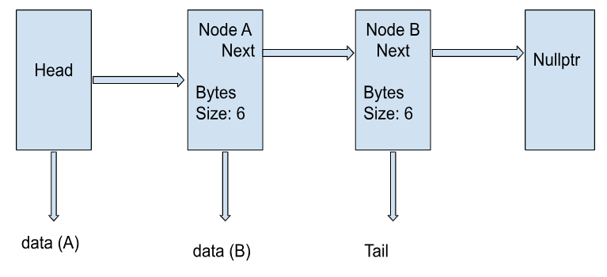

## Project-1 Remote GitHub Development and Performance Monitoring

## Experiment 1 -- C++ Compiler Optimizer Tests  

**Q1. Which program is fastest? Is it always the fastest?**  
**Q2. Which program is slowest? Is it always the slowest?**  

### Summary of Debug Builds: MIN_BYTES=100 MAX_BYTES=1000 NUM_BLOCKS+100000
**Builds: OPT=-g and OPT=-O2 -g2
| Program    | Avg (-g)| Avg (-O2-g2) | Speedup mult.  | Notes     
|------------|---------|--------------|----------------|-------------------------------------|
| alloca.out | 0.450   | 0.157        | 2.866x faster  | very fast optimized run             |
| malloc.out | 0.415   | 0.168        | 2.470x faster  | Similar speed up time to alloca.out |
| list.out   | 1.594   | 0.176        | 9.057x faster  | Big increase, but still slower      |
| new.out    | 1.614   | 0.178        | 9.067x faster  | Slowest, but another big improvement| 

**Answer 1:** In an optimized run (OPT=-O2 -g2), alloca.out is the fastest, but it isn't always. The unoptimized run with the same number of byte range and 10 trials puts malloc.out in the lead by a narrow margin. This shows how optimization can produce different results based on different program memory allocation techniques.

**Answer 2:** In both an optimized and an unoptimized test, new.out is the slowest of the four programs, but list.out is also slow compared to the other two. It should be noted that in the optimized build of both, a substantial improvement in speed was recorded. This shows how drastically optimization can affect new pointer heavy runs.

## Experiment 2 -- Data per Node Tests

**Q1. Was there a trend in program execution time based on the size of data in each Node? If so, what, and why?**

### Optimized build Small Data per Node Test  
(OPT=-O2 -g2), MIN=10, MAX=10, NUM_BLOCKS=100,000, TRIALS=10

| Program    | Avg (s) | Min (s) | Max (s) | Notes                         |
|------------|---------|---------|---------|-------------------------------|
| alloca.out | 0.010   | 0.010   | 0.010   | Fastest                       |
| malloc.out | 0.020   | 0.020   | 0.020   | Second                        |
| list.out   | 0.021   | 0.020   | 0.020   | Third                         |
| new.out    | 0.025   | 0.020   | 0.030   | Fourth                        |  

### Optimized build Medium Data per Node Test
(OPT=-O2 -g2), MIN=100, MAX=1000, NUM_BLOCKS=100,000, TRIALS=10

| Program    | Avg (s) | Min (s) | Max (s) | Notes                         |
|------------|---------|---------|---------|-------------------------------|
| alloca.out | 0.163   | 0.160   | 0.190   | Fastest                       |
| malloc.out | 0.169   | 0.160   | 0.180   | Second                        |
| list.out   | 0.177   | 0.170   | 0.190   | Third                         |
| new.out    | 0.180   | 0.170   | 0.190   | Fourth                        |  

### Optimized build Large Data per Node Test
(OPT=-O2 -g2), MIN=1024, MAX=4096, NUM_BLOCKS=100,000, TRIALS=10

| Program    | Avg (s) | Min (s) | Max (s) | Notes                         |
|------------|---------|---------|---------|-------------------------------|
| alloca.out | 0.788   | 0.760   | 0.840   | Fastest                       |
| malloc.out | 0.792   | 0.730   | 0.820   | Second                        |
| list.out   | 0.809   | 0.630   | 0.910   | Third                         |
| new.out    | 0.821   | 0.750   | 0.840   | Fourth                        | 

**Answer 1** Yes, runtime increases as bytes per node increases with all the programs. This is because the Nodes contain more bytes to initialize which requires larger buffers in memory. Allocation cost is not that important in this case as it doesn't scale with pay-load increases. It is dealing with the bytes themselves that causes increases in runtime.

## Experiement 3 -- Block Chain Length Tests

**Q1. Was there a trend in program execution time based on the length of the block chain?**

### Optimized build Block Chain Length
(OPT=-O2 -g2), MIN=100, MAX=1000, NUM_BLOCKS=10K, TRIALS=10

| Program    | Avg (s) | Min (s) | Max (s) | Notes                         |
|------------|---------|---------|---------|-------------------------------|
| alloca.out | 0.020   | 0.020   | 0.020   | All Same                      |
| malloc.out | 0.020   | 0.020   | 0.020   | All Same                      |
| list.out   | 0.020   | 0.020   | 0.020   | All Same                      |
| new.out    | 0.020   | 0.020   | 0.020   | All Same                      |  

### Optimized build Block Chain Length
(OPT=-O2 -g2), MIN=100, MAX=1000, NUM_BLOCKS=100K, TRIALS=10

| Program    | Avg (s) | Min (s) | Max (s) | Notes                         |
|------------|---------|---------|---------|-------------------------------|
| alloca.out | 0.164   | 0.160   | 0.170   | Tied First                    |
| malloc.out | 0.164   | 0.160   | 0.180   | Tied First                    |
| list.out   | 0.173   | 0.160   | 0.190   | Third                         |
| new.out    | 0.172   | 0.170   | 0.180   | Second                        |  

### Optimized build Block Chain Length
(OPT=-O2 -g2), MIN=100, MAX=1000, NUM_BLOCKS=1M, TRIALS=10

| Program    | Avg (s) | Min (s) | Max (s) | Notes                         |
|------------|---------|---------|---------|-------------------------------|
| alloca.out | 1.614   | 1.590   | 1.700   | Second                        |
| malloc.out | 1.595   | 1.580   | 1.163   | Fastest                       |
| list.out   | 1.672   | 1.510   | 1.740   | Third                         |
| new.out    | 1.673   | 1.630   | 1.720   | Fourth                        |

### Optimized build Block Chain Length  
(OPT = -O2 -g2), MIN = 10, MAX = 10, NUM_BLOCKS = 5 M, TRIALS = 10  

| Program    | Avg (s) | Min (s) | Max (s) | Notes                    |
|------------|---------|---------|---------|--------------------------|
| alloca.out | 0.964   | 0.870   | 1.070   | Fastest - stack based    |
| malloc.out | 1.127   | 1.090   | 1.180   | Second - heap allocation | 
| new.out    | 1.475   | 1.400   | 1.590   | Third custom linked list |
| list.out   | 1.486   | 1.420   | 1.600   | Slowest pointer based    |

**Answer 1:** Runtime grows with NUM_BLOCKS, but the growth is fairly linear. The more blocks you create, the more allocations are needed to process the bytes per node. With large NUM_BLOCKS, a more noticiable difference becomes clear. malloc/alloca are in the lead and list/new follow due to pointer creation and less efficient cache usage.   

The 5 million block test with bytes capped at 10 shows these differences most clearly. Since the overall payload is quite small in bytes, we can see with higher resolution the effect of a higher NUM-BLOCKS test.

## Experiment 4 -- Heap Alocations

**Q1. Consider heap breaks, what's noticeable?**  
**Q2. Does increasing the stack size affect the heap? Speculate on any similarities and differences in programs?**

### Heap breaks (NUM_BLOCKS=100000)
| Program    | brk/sbrk calls  |
|------------|-----------------|
| alloca.out | 69              |
| list.out   | 559             |
| malloc.out | 542             |
| new.out    | 559             |

**Answer 1:** list.out and new.out make a new heap request for every node they create. That’s why they trigger a lot more brk() and sbrk() calls. Each node gets its own little chunk of memory. 

malloc.out also uses the heap, but the C memory manager can request large chunks of memory at once and deliver pieces of that memory in smaller chunks. This increases its memory efficiency and makes its break count slightly lower.

alloca.out doesn’t use the heap at all. I uses the stack, which is temporary memory for the current function so it has far fewer heap breaks.

**Answer 2:** When you run ulimit -s unlimited, you’re just telling the system to let this program use much more stack space. That change only helps alloca.out, since it stores nodes on the stack. Since the heap and stack are two separate memory areas, when you increase the stack size, the heap is not changed. The differences in performance you see between programs has to do with how each one stores its data and utilizes memory. If it uses the stack, it will just be faster with many fewer break calls. 

In summary:
alloca.out = stack
malloc.out, new.out, list.out = heap

## Memory Diagram

Considering either the malloc.cpp or alloca.cpp versions of the program, generate a diagram showing two Nodes. Include in the diagram
the relationship of the head, tail, and Node next pointers.  
- show the size (in bytes) and structure of a Node that allocated six bytes of data
- include the bytes pointer, and indicate using an arrow which byte in the allocated memory it points to.

- malloc version of memory with a linked list
- Each node stores 6 bytes of data via the bytes pointer.
- Node A.next points to Node B
- Node B.next is nullptr.”

## Summary

**Q1. There's an overhead to allocating memory, initializing it, and eventually processing (in our case, hashing it). For each program, were any of these tasks the same? Which one(s) were different?**  

**Answer 1:**   
Same:  
- A Hashing pass over the actual data implies that all tasks are the same. We used the same algorithm and same bytes and then compared the result.  

Different:    
- Using alloca to allocate memory is very cheap with stack usage. malloc, list and new use the heap with multiple system calls for memory. Not as efficienct.
- All methods must touch data and process at the neccessary bytes, but allocator and node wiring differs. Since the stack is contiguous by nature, it is definitely the most efficient for cache handling.

**Q2. As the size of data in a Node increases, does the significance of allocating the node increase or decrease?**  

**Answer 2:** It decreases. As payload grows, allocation cost which grows linearly becomes a smaller fraction of total work which can grow exponentially faster depending on the memory allocation method.

