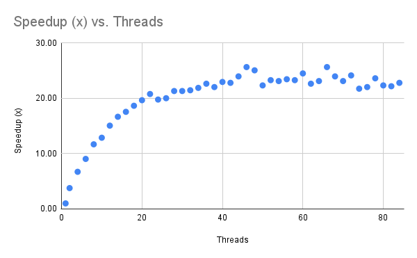
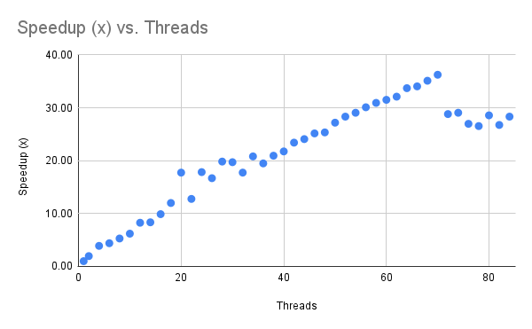

# Project 2 Threading and Multicore Applications

## 1. Computing a Mean (Threading Analysis)

### 1.1 Speedup Formula
Speedup is defined as:

$$
\text{speedup} = \frac{\text{single-thread running time}}{\text{multi-threaded running time}}
$$

### 1.2 Speedup Chart `threaded.cpp`

### 1.3 Curve Shape and Convergence

**Question:** For the graph, note the shape of the curve. Does it “converge” to some general value? What’s the maximum speedup you got from threading? What happens when you use more cores than are available in the hardware?

**Response:**

- The **speedup curve** slopes up quickly for lower thread counts and then levels off after ~20 threads where it **stays in the mid-20x range**. After that point, the data points fluctuate a bit but do not resume an upward trend.
- The **maximum speedup is 25.66x at thread count 46**.
- Blue's system has **72 cores**, and trials.sh runs up to **84 threads**. Beyond ~70 threads, the kernel runs more threads than cores available, and no additional speedup is seen. Even before that, we see performance drop, so the **limiting factor** must relate to the **overall bandwidth** of the hardware. This may be why the curve flattens just before the physical core limit.

---
## 2. Linear Scaling

**Question:** Considering the number of cores in the system, do you get a linear scaling of performance as you add more cores?

**Response:**
- The performance scales linearly at the beginning, up to ~36 threads. After that, the speedup is not linear, and by the time thread count equals the number of cores on Blue, the curve has flattened and is falling slightly. So, that means at low thread counts, linear scaling is possible, but past a certain point, we see only diminishing returns.

---
## 3. Amdahl’s Law

**Question:** Looking at your graph, what value would you propose for \( p \), and how did you arrive at that value?

**Response:**

Amdahl’s Law gives the formula for the parallel fraction \( p \):

$$
p = \frac{t - t_s}{t}
$$

where:

- t = 1-thread runtime
- $t_s$ = serial portion of the program (not parallelizable)

To estimate $t_s$, we use the maximum observed speedup:

$$
S_{\max} = \frac{t}{t_s}
$$

Solving for $t_s$:

$$
t_s = \frac{t}{S_{\max}}
$$

From my measurements:

- t = 33.71 seconds (1 thread)
- $S_{\max}$ = 25.66

So:

$$
t_s = \frac{33.71}{25.66} \approx 1.313 seconds
$$

Finally, compute p:

$$
p = \frac{t - t_s}{t}
= \frac{33.71 - 1.313}{33.71}
\approx 0.96
$$

So about **96%** of the runtime is parallelizable and about **4%** is serial.

## 4. Memory Bandwidth and Kernel Behavior

**Question:** How many bytes of data are required per iteration? What’s the associated bandwidth used by the kernel? Is that value consistent in the threaded versions?

**Response:**

In the meanCompute kernel, each iteration of the loop reads a single `float`, which is **4 bytes per iteration**.

For the full `data.bin` file, there are 8,500,000,000 samples, so the total data read is:

$$
8{,}500{,}000{,}000 \times 4
= 34{,}000{,}000{,}000\ \text{bytes}
= 34 \times 10^9\ \text{bytes}
$$

To estimate bandwidth, we can divide this total by runtime using the baseline timing from mean.cpp (_32.84 seconds_) and then compare it with the best parallel run time at 46 threads (_1.28 seconds_).

_Baseline Bandwidth:_  

$$
\text{BW}_1
= \frac{34 \times 10^9}{32.84}
= 1.0356 \times 10^9\ \text{B/s}
\approx 1.036\ \text{GB/s}
$$  

_Best Parallel Bandwidth:_

$$
\text{BW}_{46}
= \frac{34 \times 10^9}{1.28}
= 2.65625 \times 10^{10}\ \text{B/s}
\approx 26.563\ \text{GB/s}
$$

At higher thread counts, the bandwidth will all be similar across all runs because the program becomes limited by the memory hardware itself. Adding more threads at higher levels won't change the performance which matches the flattening of the curve we see on the chart. There are just plain diminishing returns past thread ~46.

---
## 1. Computing a Volume (Threading Analysis)

### 1.1 Speedup Formula

Speedup is defined as:

$$
\text{speedup} = \frac{\text{single-thread running time}}{\text{multi-threaded running time}}
$$

---

### 1.2 Speedup Chart

---

### 1.3 Curve Shape and Comparison to threaded.out

**Question:** Do you get a similar performance curve to `threaded.out`?

**Response:**

**Yes**, the overall shape is similar, but the Monte Carlo kernel scales further before flattening.

**Similarities**
- Both programs use the same threading model **(fork-join)**.
- Both kernels show **linear speedup** through ~32 threads.
- Both flatten out once hardware is unable to keep the speedup going.

**Differences**
- The meanCompute curve flattened out much earlier, **~32** threads.
- The SDF Monte Carlo kernel continues scaling all the way to **~70** threads where it reached a max speedup of **36.25x.**

**But why the differences?**
- The mean kernels computational loop does very little "work" (one load and one add per iteration). It's performance is quickly limited by memory bandwidth.
- The Monte Carlo kernel does far more computation per sample:
    - Generates 3 random numbers
    - Builds a 3D point `vec3`
    - Evaluates the SDF
- Because each thread in `sdf.cpp` has more computation to do before touching memory, the CPU cores stay busy longer, and scaling continues further before hitting bandwidth and cache limits.

---

## 2. Accuracy of the Monte Carlo Estimate

### 2.1 Analytic Volume

Throw a huge number of random points into a 3D box, check with the SDF whether each one is inside your shape or not, then estimate the shape’s volume:
- (fraction of points inside) × (box volume).

The more points you throw, the better the approximation, but the more compute time you have. This is where parallelization across multiple cores pays off in terms of raw timing performance.

We start by comparing the Monte Carlo estimate to the true value:

$$
V_{\text{cube}} = (1\text{ W})(1\text{ H})(1\text{ D}) = 1
$$

$$
V_{\text{sphere}} = \frac{4}{3}\pi r^3 = \frac{4\pi (0.5)^3}{3}
$$

The approximate exact volume of our cube:

$$
V_{\text{true}} = V_{\text{cube}} - V_{\text{sphere}}
= 1 - \frac{4\pi (0.5)^3}{3}
\approx 1 - 0.5235987756
= 0.4764012244
$$
### 2.2 My Results from sdf.out

#### Running:

```bash
./sdf.out -n 1000000000 -t 1
```

#### Produced:

$$
V_{\text{est}} = 0.476411
$$
#### Absolute Error

$$
\text{error}
= \left| V_{\text{est}} - V_{\text{true}} \right|
= \left| 0.476411 - 0.4764012244 \right|
= 0.0000097756
\approx 9.78 \times 10^{-6}
$$
### Final Table

| Points (N)    | Threads | Estimated Volume | Error                 |
| ------------- | ------- | ---------------- | --------------------- |
| 1,000,000,000 | 1       | 0.476411         | $9.78 \times 10^{-6}$ |

---

## 3. Runtime & Speedup

### 3.1 Timing Table

Summary of times up through 84 threads:

| N (samples)   | Threads | Time (s) |
| ------------- | ------- | -------- |
| 1,000,000,000 | 1       | 33.71    |
| 1,000,000,000 | 2       | 17.25    |
| 1,000,000,000 | 4       | 8.67     |
| 1,000,000,000 | 8       | 6.38     |
| 1,000,000,000 | 16      | 3.41     |
| 1,000,000,000 | 32      | 1.90     |
| 1,000,000,000 | 64      | 1.00     |
| 1,000,000,000 | 70      | 0.93     |
| 1,000,000,000 | 84      | 1.19     |
Note that the 70 thread run is where the **maximum speedup occurs**, just below the physical core count of 72.

---

### 3.2 Speedup Table

Using:

$$
\text{speedup(T)} = \frac{\text{33.71}}{\text{time(T)}}
$$

Summary of Thread Counts up to max speedup (x):

| Threads | Time (s) | Speedup |
| ------- | -------- | ------- |
| **1**   | 33.71    | 1.00×   |
| **2**   | 17.25    | 1.95×   |
| **4**   | 8.67     | 3.89×   |
| **8**   | 6.38     | 5.28×   |
| **16**  | 3.41     | 9.89×   |
| **32**  | 1.90     | 17.74×  |
| **64**  | 1.00     | 33.71×  |
| **70**  | 0.93     | 36.25x  |

---

### 3.3 Observations

- The Monte Carlo kernel continues scaling until 70 threads.
- The meanCompute kernel flattened earlier because of less work per iteration and more reliance on memory bandwidth which tasked the system.
- At high thread counts, I saw occasional timing outliers and small oscillations in the measured times, possibly due to Blue struggling with shared resources.
- Max speedup is **36.25× at 70 threads**.
- At 84 threads runtime actually increases to 1.19 s, so speedup does not scale infinitely.

---

## 4. Threading Discussion

### 4.1 Why Monte Carlo Parallelizes Well

- Each sample point is tested independently.
- Perfectly parallel workload "embarrassingly parallel.
- More computation per sample means less time waiting on memory

### 4.2 Why Speedup has diminishing returns

- RNG cost per thread - each sample uses multiple random numbers which leans on each core individually.
- Thread creation cost - at high thread count, OS overhead matters more.
- Memory bandwidth and cache limitations - adding more cores doesn't help past a certain point because of hardware limitations.
- Past physical core count of 72 - threading helps to squeeze out a little extra performance, but no where near where it started.

So the program scales well until the system becomes overburdened and the only way to get more performance would be to "throw more hardware at it"

## Extra Credit: sdf

To implement the extra credit optimization challenge, I used the help of ChatGPT to iteratively modify the baseline `sdf.cpp` program and tried to focus on understanding how the changes made would effect where exactly timing could be cut shorter. I treated this more like an exercise in push "levers" that I did not know the function of, with the trust of the machine to guide me through the process.

According to ChatGPT, the largest gains came from removing unnecessary work in the hot loop (avoiding square root calculations by comparing squared distances, eliminating object construction and function calls inside the loop), and replacing the standard library RNG facilities with a lightweight, per-thread pseudorandom generator that still produces a uniform distribution in [0,1], and improving thread efficiency by reducing synchronization and cache contention.

The above changes are WAY beyond my level and would not have been thought of, even if given all the time in the world. I just plain, do not have the experience level to know how to implement such code. That said, I do know what a benchmark is and while I didn't write the code, I did record each change in timing against previous versions as the code evolved and I noted them for their overall impact.

I do not expect any actual extra credit for this, (it probably wouldn't win anyway) but it was an interesting process that, even though beyond what I could independently create, I learned a little bit more about how incrementally modifying algorithmic choices can lead to some serious performance improvements.

### Results
### sdf-fastest.cpp (fastest single-thread)
Build:
g++ -O3 -march=native -std=c++20 -pthread sdf-fastest.cpp -o sdf-fastest.out

Run:
./sdf-fastest.out -n 50000000 -t 1

Timing:
real 0.18
user 0.18
sys  0.00


### sdf-speedup.cpp (best speedup)
Build:
g++ -O3 -march=native -std=c++20 -pthread sdf-speedup.cpp -o sdf-speedup.out

Run:
./sdf-speedup.out -n 50000000 -t 1
./sdf-speedup.out -n 50000000 -t 8

Timing:
t=1 real 0.18
t=8 real 0.03
Speedup (t=1 / t=8): 6.0x

---
## Sources

- CS 351 Project 2 brief.
- Course slides on threading and performance (Slide Deck #17).
- `threaded.out` meanCompute implementation and timing data captured using /usr/bin/time.
- `sdf.cpp` implementation and timing data collected on Blue using `/usr/bin/time`.
- "Multithreading (computer architecture)." *Wikipedia, The Free Encyclopedia.*  
  https://en.wikipedia.org/wiki/Multithreading_(computer_architecture)
- Portions of the explanation and wording were assisted by ChatGPT,
  including refinements to structure and for gaining clarity on the topic of multithreading.
