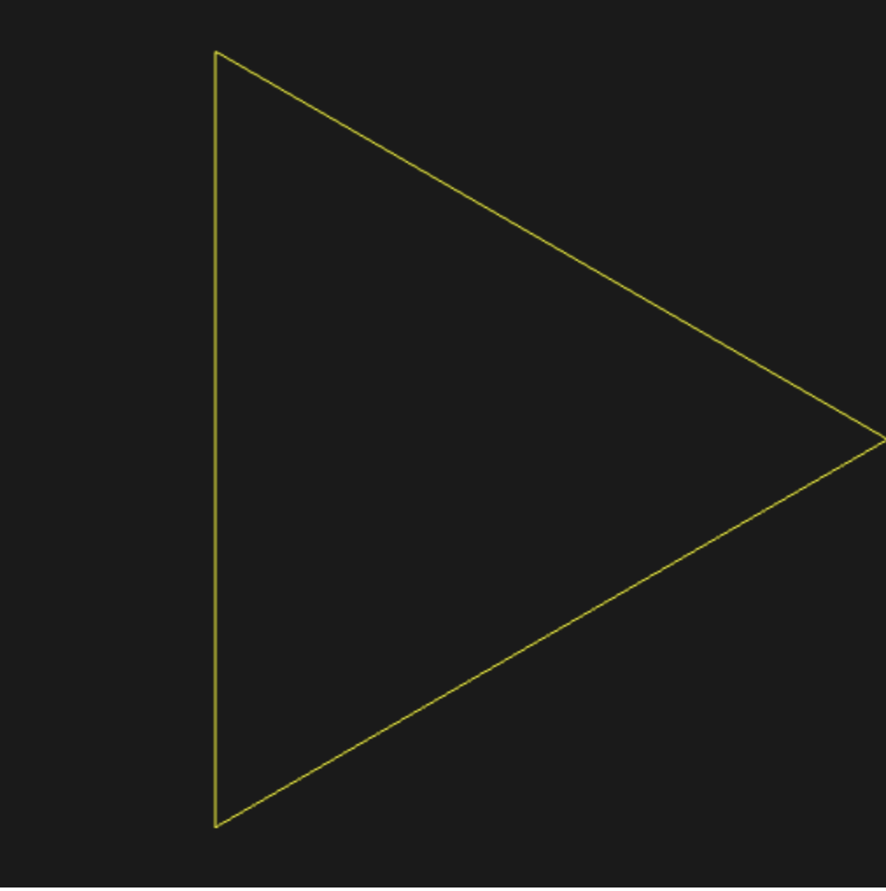
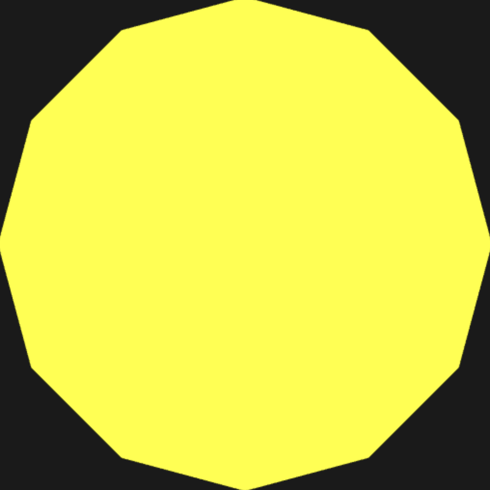

## Description

This project contains several WebGL demo programs created for CS 351 Project 3.  
Each HTML file runs a different shader based graphics demo directly in the browser.
## Table of Contents

### HTML Applications

- [Triangle](triangle.html)  
  

- [Polygon](polygon.html)  
  

- [Star](star.html)  
  

### Animation Files

- [Spinny (repo file)](spinny.html)  
  Demo on Blue: [spinny.html](https://blue.cs.sonoma.edu/~wmeyer/cs351/spinny.html)

- [Shiny Spinny (repo file)](shiny_spinny.html)  
  Demo on Blue: [shiny_spinny.html](https://blue.cs.sonoma.edu/~wmeyer/cs351/shiny_spinny.html)

## Extra Credit Final Thoughts

This part of the project ended up being my favorite. Not only is it cool to animate pictures, but adding colors through the shader block made the whole thing all the more unique. I also didn't need to lean on ChatGPT at all to implement it. The instructions were clear and gave me enough to experiment on without telling me exactly what to write. I was able to play with the code to learn how each part worked and then tweak it to get the result I was happy with.

I see how exporting the radius value from the vertex shader and then using it in the fragment shader allowed the data. to generate a moving image. I felt like I understood how we were using math and the shader together to make the star "shine" and it was a confidence boost to feel like I could do it myself.

