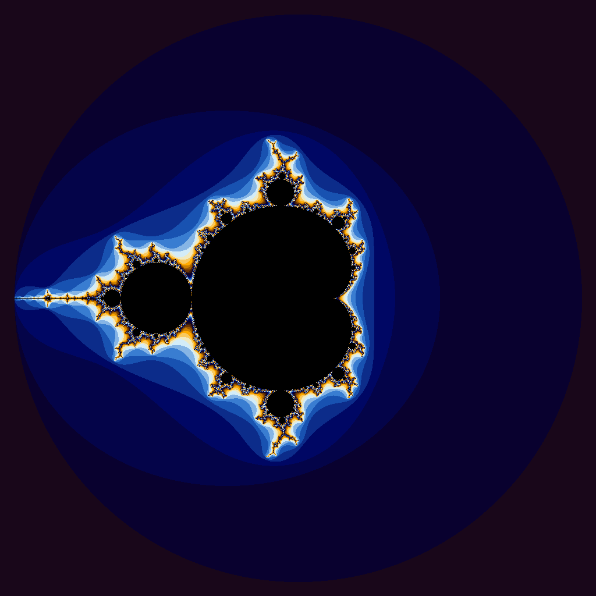

# **Project 6 — CUDA Applications**

**CS 351 — Computer Architecture**  
**Name:** Will Meyer  
**GPU:** RTX A6000 (Oblivus)

---

## **Part 1 — CUDA `iota` Implementation**

### **Summary**

This project looks at CUDA programming by converting two CPU-based programs into GPU accelerated versions:
### **Description (CPU vs GPU Version)**

**std::iota implementation**

- CPU baseline in `iota.cpp` uses `std::iota` to fill a vector with sequential values.
- CUDA version in `iota.cu` implements the same behavior with a simple kernel (one thread per element).
- Performance is compared using `runTrials.sh`, which runs both versions over multiple vector sizes and records wall-clock, user, and system time.

---

### **Description (CUDA Version)**

For the CUDA version, the single-threaded `std::iota` call is replaced with a data parallel kernel that assigns one thread per array element.

- First, the host allocates device memory with `cudaMalloc` and prepares the inputs (vector size and starting value).
- Next, a 1D grid of thread blocks is launched. Each thread computes its global index:

    
idx = blockIdx.x * blockDim.x + threadIdx.x

- If `idx < N`, that thread writes its value:

    
data[idx] = start + idx;

- Once the kernel completes, the host copies the results back with `cudaMemcpy` and frees the device memory.

This approach is considered embarrassingly parallel because each output element is independent. This allows the GPU to populate very large arrays efficiently because once the size of the elements become large, the fixed kernel launch and memory transfer overheads become amortized.

---

### **Timing Results**

Run using:

`./runTrials.sh ./iota.cpu ./runTrials.sh ./iota.gpu`

### CPU iota Results

| Vector Length | Wall Clock Time | User Time | System Time |
| :--------------- | -----------------: | --------: | ----------: |
| 10               |               0.00 |      0.00 |        0.00 |
| 100              |               0.00 |      0.00 |        0.00 |
| 1000             |               0.00 |      0.00 |        0.00 |
| 10000            |               0.00 |      0.00 |        0.00 |
| 100000           |               0.00 |      0.00 |        0.00 |
| 1000000          |               0.00 |      0.00 |        0.00 |
| 5000000          |               0.02 |      0.00 |        0.01 |
| 100000000        |               0.53 |      0.08 |        0.44 |
| 500000000        |               2.64 |      0.40 |        2.23 |
| 1000000000       |               5.32 |      0.84 |        4.47 |
| 5000000000       |              33.30 |      5.58 |       27.70 |
## GPU iota Results

| Vector Length | Wall Clock Time | User Time | System Time |
| :--------------- | -----------------: | --------: | ----------: |
| 10               |               0.11 |      0.01 |        0.10 |
| 100              |               0.09 |      0.00 |        0.08 |
| 1000             |               0.09 |      0.00 |        0.08 |
| 10000            |               0.10 |      0.00 |        0.08 |
| 100000           |               0.09 |      0.00 |        0.08 |
| 1000000          |               0.09 |      0.01 |        0.08 |
| 5000000          |               0.11 |      0.01 |        0.10 |
| 100000000        |               0.39 |      0.07 |        0.31 |
| 500000000        |               1.53 |      0.31 |        1.21 |
| 1000000000       |               3.29 |      0.93 |        2.35 |
| 5000000000       |              16.92 |      4.58 |       12.33 |

---

### **Question: Are the results what you expected?**

Yes, the results are what I expected because `iota` does very little work per element, so CUDA's fixed overhead of launching the kernel and allocating memory is the dominant factor for higher runtime with small to medium vector sizes. Only when a vector becomes very large, for example, at 500 million elements, where CPU time took 2.64 seconds and GPU time took 1.53 seconds does the GPU have enough total work to amortize that overhead and begin to outperform the CPU.

---

### **Question: Why isn’t CUDA a great solution for this problem?**

CUDA is not a great choice for this problem because `iota` is bound by memory constraints, not the actual computation. The GPU's strength comes from performing large amounts of arithmetic in parallel operation, but in this implementation, each thread only does a single addition and then a write to memory. Since memory throughput is the limiting factor, not computation, the GPU can not accelerate the task beyond what the CPU's cache and vectorized instruction already handles very well.

---

## **Part 2 — CUDA Julia / Mandelbrot Renderer**

### **Description (CPU Version)**

The CPU implementation computes the Julia set by iterating one pixel at a time in two nested loops over the image dimensions. For each pixel:
1. The program maps the pixel (x,y) to its corresponding point in the complex plane using a precomputed pixel size (d) and a center offset.
2. It uses the iterative Julia formula:

z = z^2 +c

until either:
- |z| >= 2, meaning it diverges
- or MaxIterations is reached
3. The number of iterations determines the pixel's color via setColor().
4. The resulting RGB values are stored in a 1D array and written to a PPM image file.

This approach would be considered an "embarrassingly parallel" problem as each pixel's computation is independent, ideal for GPU acceleration.

---

### **Description (CUDA Version)**

The CUDA version parallelizes the CPU algorithm by assigning one GPU thread per pixel. Each thread computes its own (x,y) coordinates using `blockIdx`, `blockDim`, and `threadIdx`, maps that location into the complex plane, and runs the same Julia iteration loop as the CPU.

The color is chosen with a device only `setColor()` function.

The host code allocates a pixel buffer in GPU memory, launches a 2D kernel grid sized to cover the entire image, waits for completion, and copies the results back to the CPU to write the final PPM file. Aside from the parallelization and GPU math, the computation is the same as the CPU version.

---

### **Generated Images**

**Mandelbrot set**

**Julia set**

---
## **Notes & Final Reflections

This project helped me practice CUDA acceleration, but I found the actual implementation challenging without having practiced this concept before. I copied over the nested CPU loop into the CUDA kernel, but it was not intuitive what to do with it from there. Specifically, understanding how to map the code model we had from the slide deck was not enough of a reference for me to reconstruct the logic using the (x,y) coordinates from the CUDA block.

I did give thought to how the program should operate, but I just couldn't see how the variables of the original program corresponded to what the kernel needed. At that point, I needed to lean on ChatGPT for clarity on the project, and this helped me eventually arrive at a working solution. I am realizing that I need more examples and exercises that drill on how to combine a CUDA kernel with a typical CPU workload.

Overall, I enjoyed this project, despite the challenges, and it did improve my understanding of how work is divided among GPU threads. This concept is not a difficult one to comprehend and it makes perfect sense that certain workloads will benefit much more from GPU acceleration than others depending on how the data is arranged in memory. 